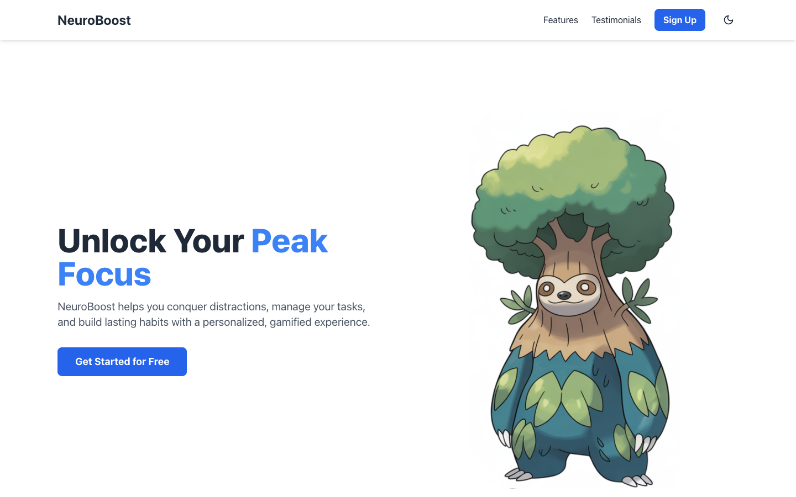
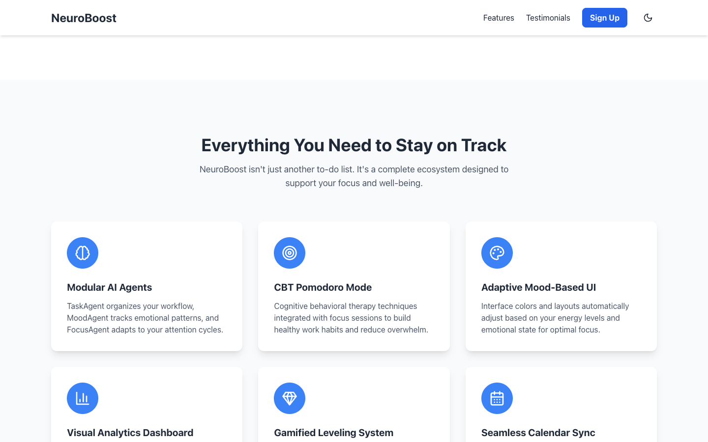
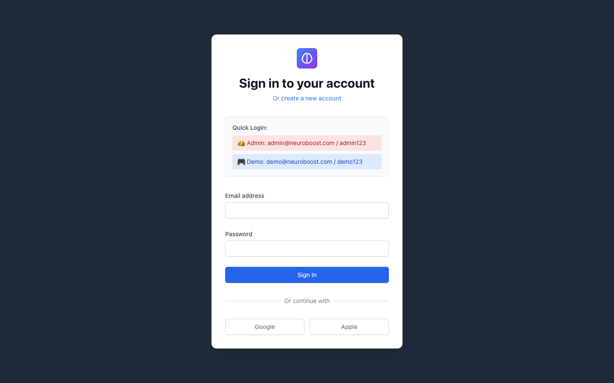

# NeuroBoost

NeuroBoost is a productivity app built for ADHD brains. Talk to it and it turns what you say into tasks, tell it how you're feeling and the whole interface shifts color and layout to match, and it wraps the whole thing in a bit of gamification so tracking your day doesn't feel like a chore.

It started as a hackathon project built around a handful of sponsor APIs (Claude, Gemini, Groq, Vapi, Letta, Orkes), so some parts are a lot more finished than others. This readme is meant to be a straight-up honest description of what's here.

## Features

**Task management**
- Add, edit, complete, and delete tasks from the UI or by voice
- Daily view, weekly view, and a calendar view
- Tasks are saved per user in Supabase, so nothing disappears when you close the tab

**Voice input**
- Say something like "add groceries to Monday" and it shows up in your task list, no typing needed
- A dedicated ADHD language processor tries to make sense of scattered, rambling speech ("that email thing... doctor... insurance stuff, ugh") and pull the actual task out of it
- Also picks up on emotional patterns common in ADHD, like rejection sensitivity, and responds with something supportive instead of just logging a task

**Mood detection and theming**
- Reads what you type or say and shifts the app's colors and layout to match your headspace
- Calm blues when you're overwhelmed, energetic oranges when you're wired, soft grays when you're wiped out, and a few more in between

**Focus tools**
- CBT-style Pomodoro flow for focus sessions
- Analytics view with productivity and mood trend charts

**Gamification**
- XP and a leveling system
- A cat companion that grows as you knock out tasks
- Unlockable achievements

**Accounts**
- Sign up and log in through Supabase
- An admin dashboard for looking at all users and their activity

**Extras**
- Settings page, dark mode, sound notification when a task comes in

## Honest status

All of the above exists in the code and shows up in the app, but here's what to actually expect:

- The frontend needs its own `.env` file with real Supabase credentials, otherwise it just shows a blank white page with nothing on it. Setup instructions are below.
- Voice-to-task and mood detection are supposed to run through Claude, but the API key currently sitting in `.env` is being rejected. So right now both features quietly fall back to simple keyword matching instead of real language understanding. The feature works end to end, it's just not as smart as intended until the key gets fixed.
- The API Gateway (the Node service that pushes live updates over WebSocket) crashes on startup if Redis isn't running locally. Voice and task creation don't actually go through it though, so it's safe to skip for local dev.
- The analytics service and the workflow engine are just empty folders for now, a Dockerfile and a requirements.txt and nothing else. Future work.
- There's some leftover code from earlier versions floating around that isn't hooked up to anything anymore: an old Firebase login system from before the app switched to Supabase, a second unfinished login flow (Node, Postgres, JWT) that no page actually links to, and a duplicate `ai-agents` folder that's just a stub. None of it breaks anything, it's just dead weight in the repo.

## Screenshots

| Landing page | Features section |
| --- | --- |
|  |  |

| Login page |
| --- |
|  |

Those "Quick Login" buttons on the login screen are left over from the old Firebase demo accounts, so they won't actually log you in unless you create matching users in Supabase yourself.

## Tech stack

- Frontend: React, Vite, Tailwind CSS
- Voice and AI services: Python, FastAPI
- API Gateway: Node.js, Express, WebSocket, Redis
- Database and auth: Supabase (Postgres)
- AI: Anthropic Claude
- Voice calls: Vapi

## Getting started

### Just the frontend

```bash
cd frontend
npm install
```

Create a `.env` file inside `frontend/`:

```
VITE_SUPABASE_URL=https://your-project.supabase.co
VITE_SUPABASE_ANON_KEY=your-anon-key
```

Then run it:

```bash
npm run dev
```

Open http://localhost:5173. Without real Supabase credentials the landing page still loads, but login and signup won't work.

### The whole app

```bash
# AI + voice services
cd ai_agents && python3 -m uvicorn main:app --port 8000 --reload
cd voice-service && python3 -m uvicorn main:app --port 8002 --reload

# API gateway (needs Redis running first)
redis-server &
cd api-gateway && npm install && npm run dev

# frontend
cd frontend && npm install && npm run dev
```

### Environment variables

- `VITE_SUPABASE_URL` and `VITE_SUPABASE_ANON_KEY` - frontend, needed just to get the app to load at all
- `ANTHROPIC_API_KEY` - powers real mood detection and voice-to-task parsing
- `VAPI_API_KEY` and `VAPI_PUBLIC_KEY` - voice calling
- `REDIS_HOST`, `REDIS_PORT`, `REDIS_PASSWORD` - only needed if you're running the API gateway

## Project layout

```
frontend/       React app - UI, pages, voice widget, all the views
ai_agents/      FastAPI service with the mood, task, focus, and motivation agents
voice-service/  FastAPI service that handles the Vapi webhook and ADHD language processing
api-gateway/    Express + WebSocket service for real-time updates
analytics/      empty, not built yet
workflow-engine/ empty, not built yet
database/       Supabase schema
```

## Roadmap

- Fix the Anthropic API key so mood detection and voice parsing use real AI again instead of the keyword fallback
- Make the API gateway handle a missing Redis connection gracefully instead of crashing
- Build out analytics and the workflow engine, or drop them from the project
- Clean out the unused Firebase code, the second login flow, and the duplicate `ai-agents` folder
